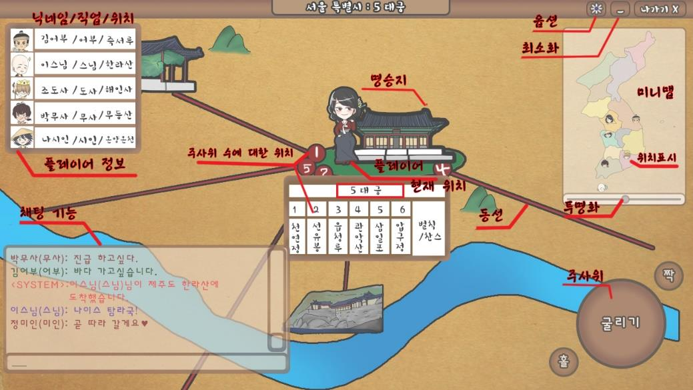
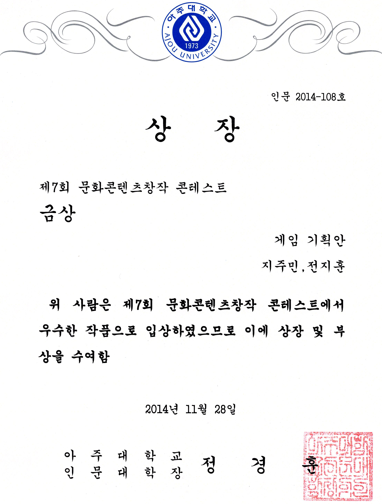

| 항목 | 내용 |
| --- | --- |
| 기간 | 2014.05 - 2014.06 |
| 소속 | 아주대학교 |
| 역할 | 기획 |
| 기술 | PowerPoint, Word |

- 조선시대 때의 부루마블과 유사한 풍속놀이인 승람도 놀이를 모바일 게임으로 재구성하여 기획
- 아주대학교 2014 문화콘텐츠창작 콘테스트 금상 수상
- [기획서 다운로드](https://drive.google.com/file/d/0BzRVCdwGHum_b2VoSDRWT2hicjg/view?usp=drive_link&resourcekey=0-YRP60k_y1Zj9kshPzDGo3A)
