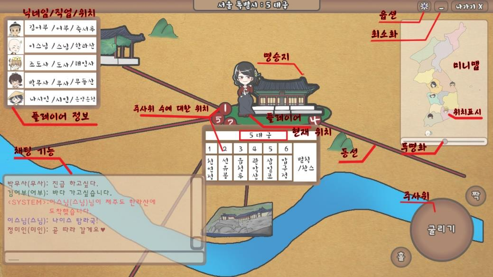
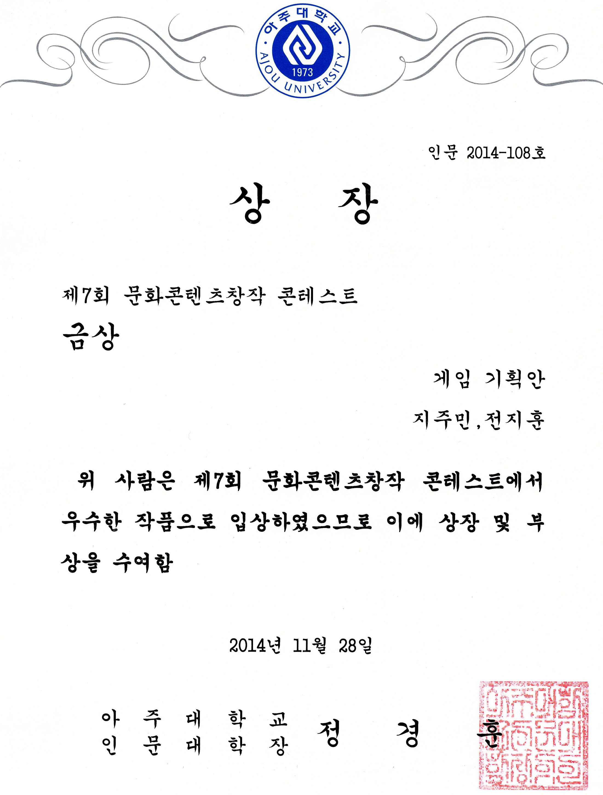

| 항목 | 내용 |
| --- | --- |
| 기간 | 2014.05 - 2014.06 |
| 소속 | 아주대학교 |
| 역할 | 기획 |
| 기술 | PowerPoint, Word |

## 프로젝트 소개

조선시대의 풍속놀이인 승람도 놀이를 모바일 게임으로 재구성한 기획 프로젝트다. 승람도는 전국의 명승지를 돌며 말을 옮기는 놀이로, 오늘날의 부루마블과 비슷한 규칙을 가진다. 기획서를 작성해 2014년 아주대학교 문화콘텐츠 창작 콘테스트에서 금상을 받았다.

- [기획서 다운로드](https://drive.google.com/file/d/0BzRVCdwGHum_b2VoSDRWT2hicjg/view?usp=drive_link&resourcekey=0-YRP60k_y1Zj9kshPzDGo3A)
