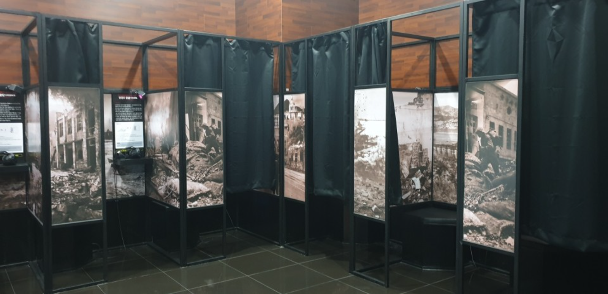
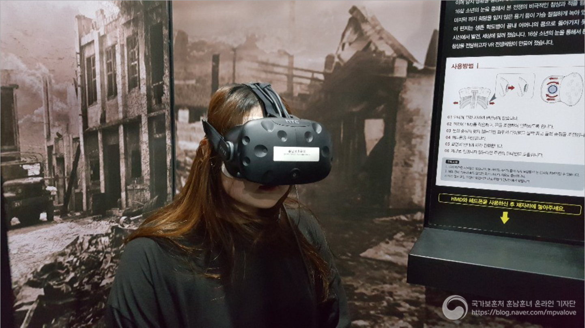

| 항목 | 내용 |
| --- | --- |
| 기간 | 2017.05 - 2017.06 |
| 소속 | 클릭트 |
| 역할 | 클라이언트 프로그래머 |
| 기술 | Unity, C#, HTC VIVE |

- [충남보훈관 VR(가상현실) 코너](http://cnbohun.chungnam.go.kr/home/content.do?menu_cd=000015)에 전시 된 "학도병의 편지" VR 콘텐츠 제작
- HTC Vive를 활용한 인터렉티브 무비
