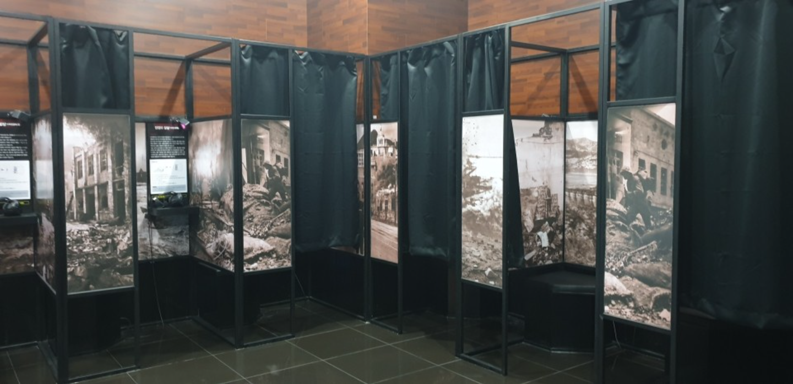
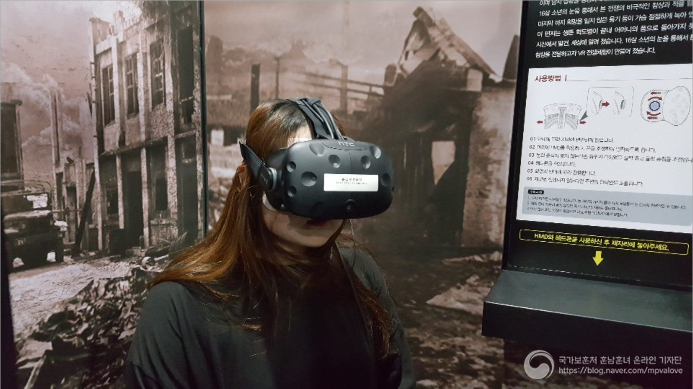

| 항목 | 내용 |
| --- | --- |
| 기간 | 2017.05 - 2017.06 |
| 소속 | 클릭트 |
| 역할 | 클라이언트 프로그래머 |
| 기술 | Unity, C#, HTC Vive |

## 프로젝트 소개

[충남보훈관 VR 코너](http://cnbohun.chungnam.go.kr/home/content.do?menu_cd=000015)에 전시된 인터랙티브 무비 VR 콘텐츠다. HTC Vive를 사용하는 인터랙티브 무비 형식으로 Unity로 제작했다.

## 담당 업무

- HTC Vive 기반 인터랙티브 무비 콘텐츠의 클라이언트 구현
