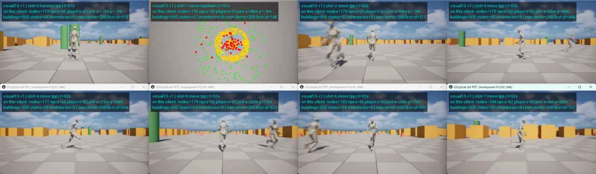
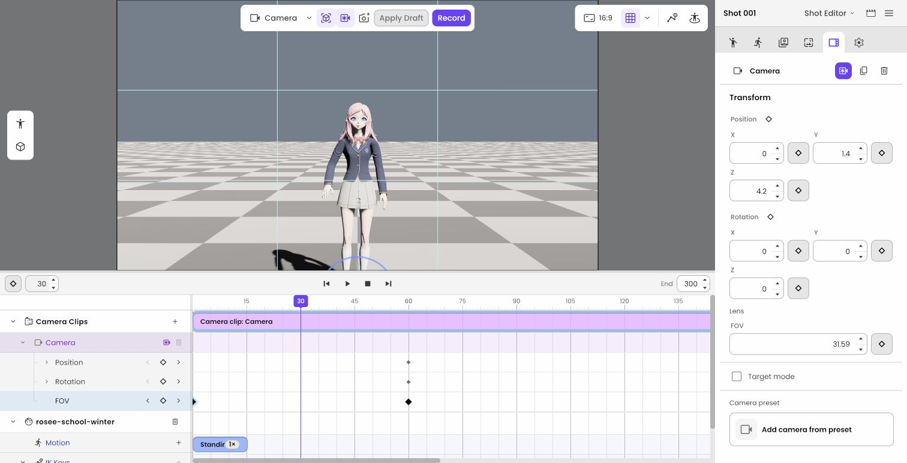
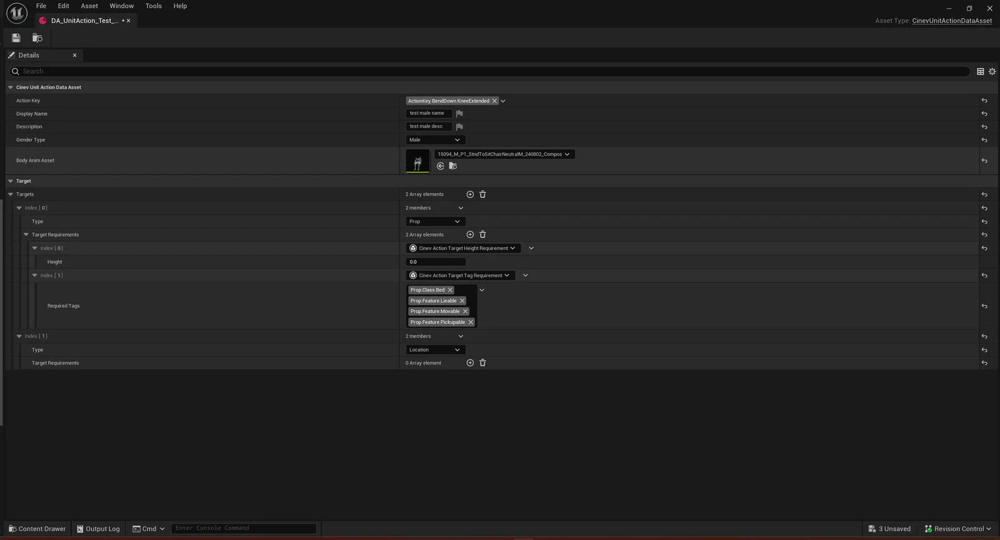
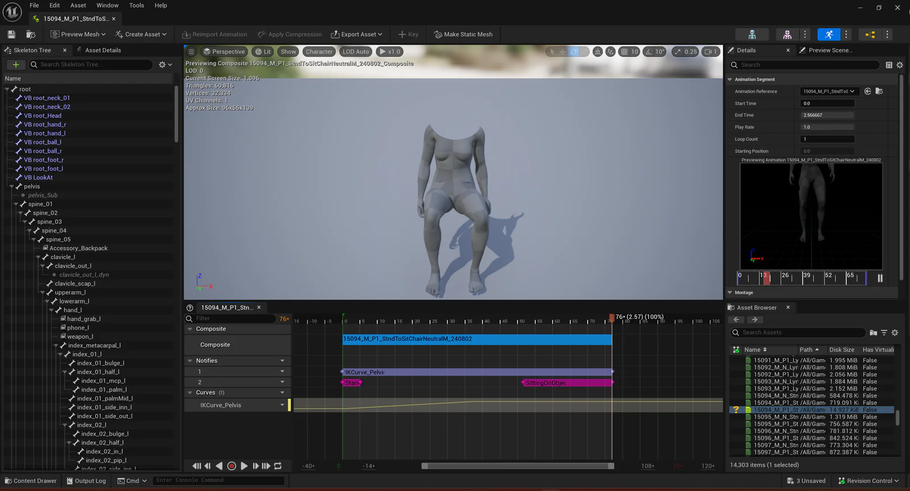
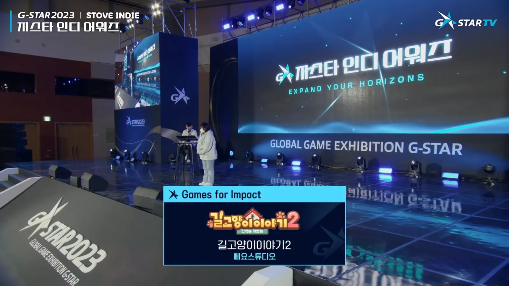
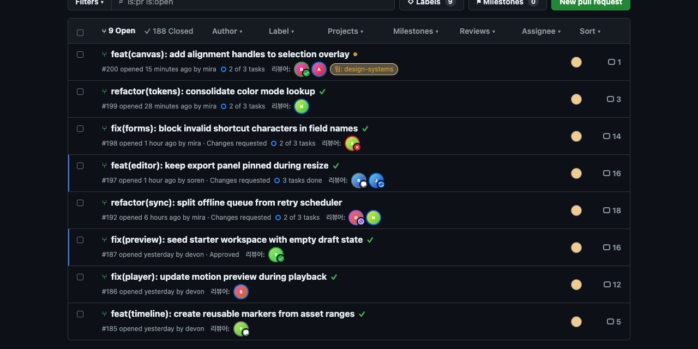
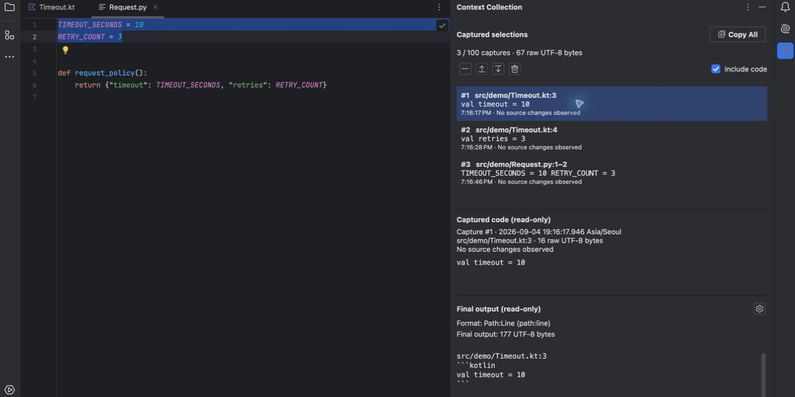

게임 클라이언트와 실시간 3D 제작 도구를 개발해 왔습니다. 대표 작업에서 맡은 문제와 구현 내용을 화면, 영상과 설계 자료로 소개합니다.

- **기술 검증:** [UE5 Dedicated Server 최적화 실험실](#ue-dedicated-server-optimization-lab)의 리플리케이션 비용 측정과 단계별 최적화 비교
- **3D 제작 도구:** [Shotloom](#shotloom)의 편집과 저장 구조, [CINEVStudio](#cinevstudio)의 액션 데이터와 편집 UI 설계
- **게임 개발과 출시:** [Night of the Dead](#night-of-the-dead)의 Dedicated Server 동기화, 다수 좀비 처리와 게임플레이 구현, [길고양이 이야기 2](#길고양이-이야기-2)의 PC 출시 전담
- **VR 장치 연동:** [CircleVR](#circlevr)의 좌표계 보정과 다중 사용자 전시, [Space Walker](#space-walker)의 실시간 모션 연동
- **개발 도구와 오픈소스:** [Grimoire](#grimoire)의 AI 에이전트 작업 흐름, [IDE 플러그인](#copy-selection-context)과 [브라우저 확장](#github-pulls-show-reviewers) 배포, [Firefly](#firefly)와 [bevy_vrm1](#bevy_vrm1) 기여

[이력서](/resume/) / [경력기술서](/cv/) / [전체 프로젝트](/projects/)

## 기술 검증 프로젝트

### [UE5 Dedicated Server 최적화 실험실](https://github.com/hon454/ue-dedicated-server-optimization-lab)

| 항목 | 내용 |
| --- | --- |
| 소개 | Unreal Engine 5.8.3 Dedicated Server의 리플리케이션 비용을 측정하고 최적화 기법을 하나씩 적용해 비교하는 실험 프로젝트 |
| 진행 기간 | 2026.10 - 진행 중 |
| 주요 기술 | Unreal Engine 5, C++, Unreal Insights, PowerShell |

*서버 하나에 접속한 클라이언트 8개의 화면입니다. 각 화면 위에는 그 클라이언트에 복제된 자원 노드, NPC, 건축물 수와 플레이어 위치를 표시합니다.*

최적화가 없는 오픈월드 서버에서 시작해 Relevancy, Dormancy, Net Update Frequency 같은 엔진 기능을 한 번에 하나씩 적용합니다. 측정은 PC 한 대에서 서버 하나와 클라이언트 8개를 띄우고, 한 변이 2km인 맵에 자원 노드 5,001개, NPC 350명, 건축물 500개를 고정 시드로 배치한 같은 시나리오로 반복합니다. 30초를 버리고 60초를 측정하는 실행을 세 번 거쳐 중앙값으로 서버 프레임 시간과 대역폭을 비교하고, 단계마다 원리와 측정 근거를 글로 정리합니다.

기법을 켜고 끄는 핵심 설정은 [자원 노드의 Relevancy, Dormancy와 갱신 빈도 설정](https://github.com/hon454/ue-dedicated-server-optimization-lab/blob/51816f637c4b8a99013e5c14591cd41cfdb85345/Source/DSOptLab/LabResourceNode.cpp#L19-L29)에서, 단계별 차이는 [단계별로 최적화해 보기](https://hon454.github.io/ue-dedicated-server-optimization-lab/)에서 볼 수 있습니다.

## 주요 경력

### 시나몬

| 항목 | 내용 |
| --- | --- |
| 소속 기간 | 2024.06 - 2026.08 |
| 참여 형태 | 정규직 |
| 담당 직무 | 클라이언트 프로그래머 |

#### Shotloom

| 항목 | 내용 |
| --- | --- |
| 소개 | 캐릭터 동작과 카메라를 편집하고 영상 생성 서비스와 연결하는 브라우저 3D 편집기 |
| 참여 기간 | 2026.04 - 2026.08 |
| 주요 기술 | Rust, Bevy, WebAssembly, WebGPU, React, TypeScript, Tauri |

*0프레임과 60프레임에 카메라 키를 두고 30프레임에서 평가한 편집기 화면입니다. 타임라인에서 위치, 회전과 FOV 키를 속성별로 다룹니다. 카메라 키프레임의 편집부터 타임라인 평가와 저장 형식까지를 제가 구현했습니다.*

- **편집 명령과 Undo/Redo:** React UI, Rust 문서 모델과 Bevy 런타임이 버전이 붙은 명령과 이벤트로 통신하도록 연결하고, 이 경로 위에 Undo/Redo와 저장, 복원을 구현했습니다.
- **편집 트랜잭션과 롤백:** 드래그 시작부터 확정까지를 하나의 트랜잭션으로 기록하고, 명령이 거절되거나 외부 서비스가 실패하면 롤백해 UI와 런타임, 저장 상태를 일치시켰습니다.
- **캐릭터와 카메라 저작:** 캐릭터 배치와 포즈 후보 적용, 속성별 카메라 키프레임을 편집 UI부터 타임라인 평가와 저장 형식까지 연결했습니다. 브라우저와 CLI가 같은 Rust 코어와 번들 형식을 사용하도록 구성했습니다.
- **생성 서비스 통합:** 영상 제작 서비스 CineV의 샷을 편집 가능한 3D 장면으로 열고, 생성 영상의 마지막 프레임 이미지를 스토리보드로 돌려주도록 구현했습니다. 생성과 결과 저장을 분리해 저장에 실패하면 같은 결과를 다시 전송할 수 있게 했습니다.
- **CI 캐시 개선:** Rust CI의 캐시를 target 아카이브에서 sccache로 바꿔 캐시 크기를 1.84GB에서 684MB로 약 63% 줄였습니다. warm CI에서 컴파일 374건이 모두 캐시에 적중했습니다.

[포즈와 카메라 편집 영상](/projects/shotloom/#editing-workflow) / [저장 구조와 복원 화면](/projects/shotloom/#edit-persistence) / [서비스 통합과 검증 범위](/projects/shotloom/#service-integration)

#### CINEVStudio

| 항목 | 내용 |
| --- | --- |
| 소개 | AI가 구성한 3D 장면을 편집하고 영상으로 출력하는 Unreal Engine 기반 제작 도구 |
| 참여 기간 | 2024.06 - 2026.04 |
| 주요 기술 | Unreal Engine 5, C++, UMG, Sequencer, ONNX |

<iframe class="video-embed" src="https://www.youtube.com/embed/NQJT8oN7NGg" title="CINEVStudio 사용 예시 - 무조건 이혼한다" loading="lazy" allow="accelerometer; autoplay; clipboard-write; encrypted-media; gyroscope; picture-in-picture; web-share" referrerpolicy="strict-origin-when-cross-origin" allowfullscreen></iframe>

*액션의 대상과 요구조건(높이, 태그)을 타입별 구조로 입력하는 데이터 에셋 화면입니다.*

*테이블에 프레임 값으로 따로 기입하던 모션 구간과 이벤트 시점을 애니메이션을 보며 편집하는 AnimComposite 화면입니다. 두 화면의 액션 데이터 구조를 제가 개발했습니다.*

- **액션 데이터 작성 구조:** 문서와 대조하며 맞추던 액션 조건을 타입별 에셋 입력 구조로 바꾸고, 모션 구간과 이벤트 시점은 AnimComposite에서 편집하게 했습니다. 데이터 타입과 실행 경로, 변환기와 데이터 검증기를 개발했습니다. 제작자가 기억해 맞추던 조건 관계를 입력 구조와 검증기가 대신하게 됐습니다.
- **AI 결과의 실행과 편집:** AI의 행동 지시를 현재 장면에서 실행할 수 있는 액션으로 해석하고, 생성 모션을 선택해 타임라인에 적용하는 흐름을 구현했습니다. 이 결과도 일반 편집 데이터와 같은 Undo/Redo와 저장, 복원 경로를 거치게 했습니다.
- **편집 UI 상태 관리:** UI Controller와 편집 State로 화면, 선택과 입력 처리를 나누고 Blackboard로 공유 상태를 전달했습니다. 새 편집 기능을 State 단위로 추가하는 구조를 만들고 공통 UI 컴포넌트를 개발했습니다.
- **Shot 상태 모델:** Shot 모델 전환에서 상태 저장과 조회, 프레임 문맥과 재계산을 맡고 기존 저장 데이터를 새 모델로 이관했습니다.
- **Root Motion과 카메라:** Root Motion 키를 타임라인 조건에 맞춰 다시 계산하고, 카메라 orbit의 반경 손실과 수직 회전 뒤집힘을 해결했습니다.
- **빌드 환경과 엔진 이전:** GitLab CI 기반 빌드와 패키징, Shared DDC, Sentry 크래시 수집을 구성했습니다. Unreal Engine 5.3에서 5.7로 이전하면서 API와 서드파티 플러그인의 호환성 문제를 해결했습니다.

[액션 입력 화면과 실행 구조](/projects/cinev-studio/#data-authoring) / [UI 상태 관리와 도식](/projects/cinev-studio/#ui-state) / [제품 화면과 실제 제작 사례](/projects/cinev-studio/#product-showcase)

### 작두 스튜디오

| 항목 | 내용 |
| --- | --- |
| 소속 기간 | 2021.01 - 2024.06 |
| 참여 형태 | 정규직 |
| 담당 직무 | 클라이언트 프로그래머 |

#### Night of the Dead

| 항목 | 내용 |
| --- | --- |
| 소개 | 좀비의 습격에 대비해 방어 시설을 만들고 생존하는 오픈월드 멀티플레이 게임 |
| 참여 기간 | 2021.01 - 2024.06 |
| 팀 규모 | 약 10명, 프로그래머 3명 |
| 주요 기술 | Unreal Engine 4/5, C++, Unreal Insights, EOS, Steamworks |

<iframe class="video-embed" src="https://www.youtube.com/embed/VVwmqfkluGw" title="Night of The Dead v1.0 Trailer" loading="lazy" allow="accelerometer; autoplay; clipboard-write; encrypted-media; gyroscope; picture-in-picture; web-share" referrerpolicy="strict-origin-when-cross-origin" allowfullscreen></iframe>

- **Dedicated Server 동기화:** Unreal Insights 분석을 바탕으로 Replication Graph가 거리와 소유 관계에 따라 연결별 복제 대상을 고르게 했습니다. 인벤토리처럼 크고 자주 바뀌는 배열은 Fast TArray Replication과 커스텀 NetSerialize로 변경분만 전송했습니다.
- **다수 좀비의 실행 비용:** Animation Budget Allocator, Significance Manager와 AnimURO로 중요도와 예산에 따라 애니메이션 갱신 빈도를 조절하고, ACL로 애니메이션 데이터를 압축했습니다.
- **게임플레이 구현:** 전투, 장비의 티어와 내구도, 파츠 개조, 보스 및 일반 좀비 AI를 구현했습니다. 얼리 액세스 개발 업데이트 #03부터 2024년 5월 1.0 정식 출시까지 담당 기능을 반영했습니다.
- **엔진 이전과 파괴 연출:** UE4에서 UE5로의 이전을 주도했습니다. 물리 엔진이 PhysX에서 Chaos로 바뀌며 Chaos Destructible로는 다수 오브젝트의 파괴 연출을 감당하기 어려워 커스텀 Destructible 시스템을 구현했습니다.
- **개발 인프라:** JetBrains Space와 TeamCity On-Premise 서버를 구축해 협업 도구와 빌드, 패키징 자동화를 운영했습니다.

[장비와 전투 업데이트](/projects/night-of-the-dead/#equipment-update) / [멀티플레이 동기화](/projects/night-of-the-dead/#network-sync) / [멀티플레이 최적화 시리즈](/posts/notd-multiplayer-optimization-overview/) / [Steam 출시 페이지](https://store.steampowered.com/app/1377380/Night_of_the_Dead/)

### 삐요 스튜디오

| 항목 | 내용 |
| --- | --- |
| 소속 기간 | 2021.10 - 2023.12 |
| 참여 형태 | 비고용 팀 활동, 정규직과 병행 |
| 담당 직무 | 클라이언트 프로그래머 |

#### 길고양이 이야기 2

| 항목 | 내용 |
| --- | --- |
| 소개 | 길고양이의 모험을 다룬 2D 퍼즐 어드벤처 |
| 참여 기간 | 2021.10 - 2023.12 |
| 주요 기술 | Unity, C#, Steamworks, STOVE SDK |

<iframe class="video-embed" src="https://www.youtube.com/embed/CkWISiLW1p0" title="길고양이 이야기 2 공식 트레일러" loading="lazy" allow="accelerometer; autoplay; clipboard-write; encrypted-media; gyroscope; picture-in-picture; web-share" referrerpolicy="strict-origin-when-cross-origin" allowfullscreen></iframe>

*G-STAR 2023 인디 어워즈에서 Games for Impact 수상이 발표된 중계 화면입니다.*

- **주요 게임 시스템:** 세이브와 로드, 퀘스트, 대화, 이동, 컷신과 UI를 개발했습니다.
- **플랫폼 연동:** 컨트롤러 입력, Steam 업적과 STOVE 구매 인증을 연동했습니다.
- **PC 출시 전담:** 스토어 등록부터 다국어 빌드 준비, 출시 빌드 검수와 업로드까지 맡았습니다. 2023년 STOVE Windows 얼리 액세스와 Steam Windows, macOS 정식 출시를 진행했습니다.

[게임 영상과 출시, 수상 자료](/projects/a-street-cats-tale-2/) / [담당 범위](/cv/#a-street-cats-tale-2)

### 이메진템페스트 스튜디오

| 항목 | 내용 |
| --- | --- |
| 소속 기간 | 2019.06 - 2020.04 |
| 참여 형태 | 비고용 팀 활동 |
| 담당 직무 | 기획 및 클라이언트 프로그래머 |

#### Vapor World

| 항목 | 내용 |
| --- | --- |
| 소개 | 환자들의 내면세계를 탐험하는 2D 액션 어드벤처 |
| 참여 기간 | 2019.06 - 2020.04 |
| 주요 기술 | Unity, C#, Spine, URP |

<iframe class="video-embed" src="https://www.youtube.com/embed/1asejGtAMGY" title="Vapor World : Over the Mind - MWU Korea Awards Trailer" loading="lazy" allow="accelerometer; autoplay; clipboard-write; encrypted-media; gyroscope; picture-in-picture; web-share" referrerpolicy="strict-origin-when-cross-origin" allowfullscreen></iframe>

- **기획과 클라이언트 개발:** 스토리와 세계관을 기획하고 입력, 이동과 전투 시스템을 개발했습니다.

참여 기간 중 출품한 프로젝트가 제11회 새로운 경기 게임오디션 공동 2위에 선정됐고, MWU Korea Awards 2019 PC & Console 분야 Top 3에 올랐습니다.

[출품 영상과 개발 기록](/projects/vapor-world/)

### 육군

| 항목 | 내용 |
| --- | --- |
| 소속 기간 | 2018.03 - 2019.10 |
| 참여 형태 | 군 복무 |
| 담당 직무 | SW개발병 |
| 주요 기술 | C#, WPF, VBA |

*복무 중 받은 임명장과 표창입니다. 전장망 SW 지원과 회의 지원으로 우수상을, 을지태극훈련 지원으로 표창을 받았습니다.*

- **프로그램 개발:** C#과 WPF로 기존 프로그램을 이식하고, VBA로 엑셀 데이터 정리 프로그램을 개발했습니다.
- **시스템 운영:** 육군 지휘통제시스템의 장애 대응과 운영을 맡고 응용체계관리반 분대장으로 복무했습니다.

### 클릭트

| 항목 | 내용 |
| --- | --- |
| 소속 기간 | 2016.07 - 2018.02 |
| 참여 형태 | 정규직 |
| 담당 직무 | VR 소프트웨어 엔지니어 |

Unity 기반 VR 클라이언트와 소켓 통신을 통한 장치 연동을 담당했습니다. 아래 대표 작업 외에 [onAirVR Client 2.0](/projects/onairvr-client-2/)과 [#BeFearless - Fear of Heights](/projects/be-fearless/) 개발에 참여했습니다.

#### CircleVR

| 항목 | 내용 |
| --- | --- |
| 소개 | 여러 사용자의 VR 체험과 외부 디스플레이를 연결한 전시 시스템 |
| 참여 기간 | 2017.06 - 2018.02 |
| 주요 기술 | Unity, C#, Gear VR, HTC Vive Tracker |

<iframe class="video-embed" src="https://www.youtube.com/embed/9N7_6xO2kNQ" title="CircleVR in Hongik University" loading="lazy" allow="accelerometer; autoplay; clipboard-write; encrypted-media; gyroscope; picture-in-picture; web-share" referrerpolicy="strict-origin-when-cross-origin" allowfullscreen></iframe>

- **장치 간 좌표 보정:** HMD와 외부 트래커의 좌표계를 맞추고 장착 오프셋을 보정했습니다.
- **체험과 외부 시점 연결:** 여러 사용자의 시점을 외부 디스플레이로 연결해 체험자의 화면을 관람객과 공유하도록 했습니다.

[전시 영상과 담당 업무](/projects/circle-vr/)

#### Space Walker

| 항목 | 내용 |
| --- | --- |
| 소개 | 무용수의 움직임을 VR 공간에 실시간으로 연결하는 공연 콘텐츠 |
| 참여 기간 | 2017.05 - 2017.06 |
| 주요 기술 | Unity, C#, Perception Neuron, GPU 파티클, onAirVR |

<iframe class="video-embed" src="https://www.youtube.com/embed/S7bRLNLz0TA?start=5" title="Space Walker - Unite ’17 Seoul 키노트 오프닝 공연" loading="lazy" allow="accelerometer; autoplay; clipboard-write; encrypted-media; gyroscope; picture-in-picture; web-share" referrerpolicy="strict-origin-when-cross-origin" allowfullscreen></iframe>

- **전신 모션 연동:** Perception Neuron의 모션을 Unity Humanoid 아바타에 연결하고 좌표축 차이를 보정했습니다.
- **실시간 배경 연출:** 3D 배경 인터랙션을 구현하고, 다수의 파티클을 처리할 때의 성능 부담을 줄이기 위해 GPU 파티클 시스템을 적용했습니다.

[공연 콘텐츠와 담당 업무](/projects/space-walker/)

## 오픈소스 프로젝트

### 유지관리자 (Maintainer)

#### [Grimoire](https://github.com/hon454/grimoire)

| 항목 | 내용 |
| --- | --- |
| 소개 | AI 에이전트의 코드 리뷰, 리뷰 대응, 이슈 준비도 판단, 작업 인계와 Git 운영을 위한 재사용 가능한 Skill과 Plugin |
| 주요 기술 | Python, Codex Skills, Codex Plugins, GitHub CLI, Git |

- **개발 흐름 구성:** PR 맥락 수집부터 피드백 분류, 사용자 의사결정, 구현과 검증, 리뷰어 후속 대응까지 하나의 흐름으로 연결했습니다. 대화와 작업이 바뀌어도 결정 상태를 이어가고, 원격 변경은 사용자 확인과 검증을 통과한 뒤에만 수행합니다.
- **보호 장치:** 작업 인계와 Git 정리, 충돌 해결처럼 실수 비용이 큰 작업은 대상을 다시 확인하고, 확인에 실패하면 중단합니다.
- **동작 검증:** Python 표준 라이브러리 기반 테스트로 주요 동작을 검증합니다.
- **Skill과 Plugin 배포:** 코드 리뷰, 작업 인계와 Git 운영 절차를 Skill로 작성하고 설치 가능한 Plugin으로 제공합니다. Shotloom 개발 기간에 이 도구를 포함한 에이전트 환경을 운용했습니다.

#### [GitHub Pulls Show Reviewers](https://github.com/hon454/github-pulls-show-reviewers)

| 항목 | 내용 |
| --- | --- |
| 소개 | GitHub PR 목록에 리뷰 요청 대상과 리뷰 상태를 표시하는 Chrome 확장 프로그램 |
| 주요 기술 | TypeScript, React, WXT, GitHub REST API, Vitest, Playwright |

- **리뷰 상태 표시:** 요청된 사용자와 팀, 리뷰어별 승인 및 변경 요청 상태를 PR 목록에 표시했습니다. 한국어를 포함한 5개 언어를 지원합니다.
- **화면 갱신과 API 처리:** GitHub의 목록 갱신에 맞춰 표시를 복원하고, 페이지 단위 API 배치와 행 단위 캐시, 동시 요청 수 제한을 구현했습니다.
- **계정 연동과 배포:** GitHub App으로 계정별 비공개 저장소 접근을 처리하고 [Chrome Web Store](https://chromewebstore.google.com/detail/github-pulls-show-reviewe/hoocgjopdboeghdkfjlkngkkpbiljggk)에 배포했습니다.

#### [Copy Selection Context](https://github.com/hon454/copy-selection-context)

| 항목 | 내용 |
| --- | --- |
| 소개 | 선택한 코드의 파일 경로와 줄 번호를 함께 복사하고 여러 파일의 문맥을 모으는 JetBrains 플러그인 |
| 주요 기술 | Kotlin, IntelliJ Platform SDK, Gradle, JUnit 5, GitHub Actions |

- **코드와 위치 복사:** 선택 영역의 경로와 줄 범위를 계산하고, 여러 커서의 선택 영역과 사용자 지정 출력 형식, GitHub와 GitLab permalink를 지원했습니다.
- **문맥 수집과 검토:** 수집 당시의 코드와 위치를 스냅샷으로 보관하고, 도구 창에서 순서를 조정한 뒤 함께 복사하도록 구현했습니다.
- **검증과 배포:** 단위 테스트와 IntelliJ 플랫폼 테스트, 플러그인 호환성 검증을 구성하고 GitHub Actions에서 릴리스와 배포를 자동화해 [JetBrains Marketplace](https://plugins.jetbrains.com/plugin/30262-copy-selection-context)에 배포했습니다.

### 기여자 (Contributor)

#### [Firefly](https://github.com/CuteLeaf/Firefly)

| 항목 | 내용 |
| --- | --- |
| 소개 | Astro와 Svelte 기반의 정적 블로그 테마 |
| 주요 기술 | Astro, Svelte, TypeScript, Mermaid |

- **[GitHub 카드 빌드 캐시](https://github.com/CuteLeaf/Firefly/pull/588):** GitHub 저장소 카드를 빌드 시점 캐시로 전환해 API 장애와 사용량 제한에 대응했습니다.
- **[Mermaid 렌더러 이전](https://github.com/CuteLeaf/Firefly/pull/584):** Mermaid 렌더링을 Node.js 기반 최신 버전으로 이전하며 기존 테마의 출력 형태를 유지했습니다.
- **[카테고리 바 휠 스크롤](https://github.com/CuteLeaf/Firefly/pull/613):** 누적 이동 손실과 입력 지연을 제거하고, 가로 트랙패드 제스처를 보존하면서 목록 경계에서는 페이지 스크롤이 이어지도록 개선했습니다.
- **[레이아웃 슬롯 수정](https://github.com/CuteLeaf/Firefly/pull/587):** 페이지별 `<head>` 콘텐츠가 최상위 레이아웃으로 전달되지 않던 Astro 슬롯 구조를 수정했습니다.
- **[한국어 문서 작성](https://github.com/CuteLeaf/Firefly/pull/583):** 설치와 구성, 배포와 Markdown 확장 기능을 다룬 한국어 문서를 작성했습니다.

#### [bevy_vrm1](https://github.com/not-elm/bevy_vrm1)

| 항목 | 내용 |
| --- | --- |
| 소개 | Bevy에서 VRM 1.0 아바타를 불러오고 렌더링하는 라이브러리 |
| 주요 기술 | Rust, Bevy, WGSL, WebGPU |

- **재현과 원인 격리:** Shotloom 브라우저 편집기에서 MToon VRM을 표시한 직후 화면이 검게 변하는 문제를 Chrome WebGPU에서 재현했습니다. Metal 네이티브에서는 나타나지 않는 문제였고, 조명 단계별로 비교해 원인을 emissive 처리로 좁혔습니다.
- **[셰이더 플래그 수정](https://github.com/not-elm/bevy_vrm1/pull/57):** MToon의 `EMISSIVE_TEXTURE` 비트가 Standard Material 플래그와 충돌해 바인딩되지 않은 텍스처를 샘플링하고, 그 NaN이 톤매핑과 Bloom으로 퍼지는 것을 확인했습니다. WGSL이 MToon uniform의 플래그를 읽도록 수정했습니다.
- **편집기 반영:** 라이브러리에 기여한 수정을 Shotloom 편집기에 반영했습니다.

## 함께 일한 동료들의 추천

직책과 협업 관계는 함께 일한 당시를 기준으로 표기했습니다.

<blockquote class="career-recommendation">
  
기술적 문제의 근본 원인을 끝까지 파고드는 끈기.

  <footer class="recommendation-source">
    
<strong>홍XX</strong>시나몬 CTO, AI Lab Lead

    
상급자(비직속)번역 발췌

  </footer>
</blockquote>

<blockquote class="career-recommendation">
  
가장 신뢰했던 것은 복잡한 문제를 구조화하는 능력이었습니다.

  <footer class="recommendation-source">
    
<strong>황XX</strong>시나몬 Lead Software Engineer

    
직속 상사원문 발췌

  </footer>
</blockquote>

<blockquote class="career-recommendation">
  
주변의 문제를 발견하고, 필요한 일을 스스로 찾아 실제 변화로 만들어내는 동료입니다.

  <footer class="recommendation-source">
    
<strong>심XX</strong>시나몬 클라이언트 개발자

    
같은 팀 동료원문 발췌

  </footer>
</blockquote>

<blockquote class="career-recommendation">
  
새로운 영역의 문제를 깊게 파고들어 구조화하고, 팀이 함께 이해할 수 있는 형태로 만들어 갔습니다.

  <footer class="recommendation-source">
    
<strong>임XX</strong>시나몬 테크니컬 아티스트

    
같은 팀 동료원문 발췌

  </footer>
</blockquote>

<blockquote class="career-recommendation">
  
미래지향적이면서도 신뢰할 수 있는 엔지니어.

  <footer class="recommendation-source">
    
<strong>고XX</strong>시나몬 AI PO

    
협업 동료(타 부서)번역 발췌

  </footer>
</blockquote>

<blockquote class="career-recommendation">
  
기획과 개발의 경계를 두기보다 함께 좋은 결과물을 만들어가기 위해 고민해주는 클라이언트 개발자였습니다.

  <footer class="recommendation-source">
    
<strong>최XX</strong>시나몬 서비스 기획자

    
협업 동료(타 부서)원문 발췌

  </footer>
</blockquote>

[LinkedIn에서 추천사 전체 읽기](https://www.linkedin.com/in/jihoon-jeon-b7ab83116/details/recommendations/?detailScreenTabIndex=0)
