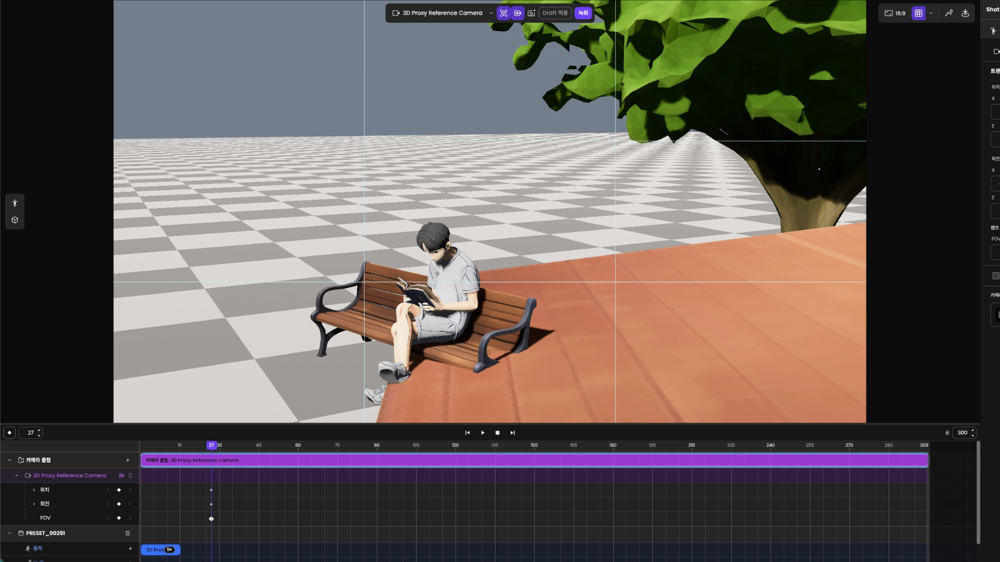
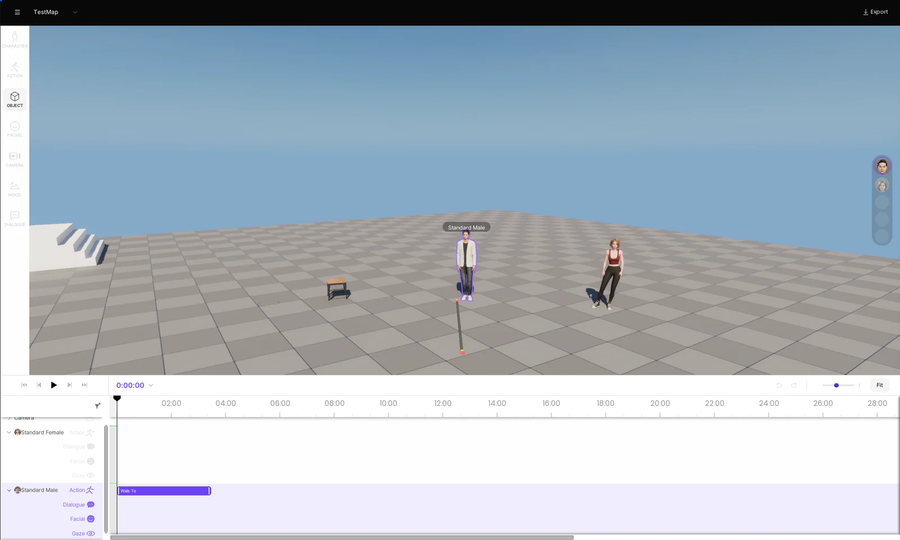
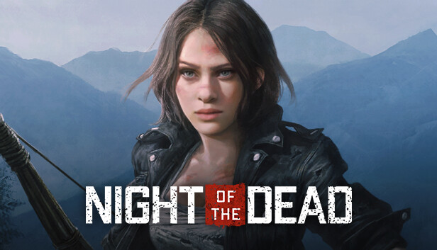
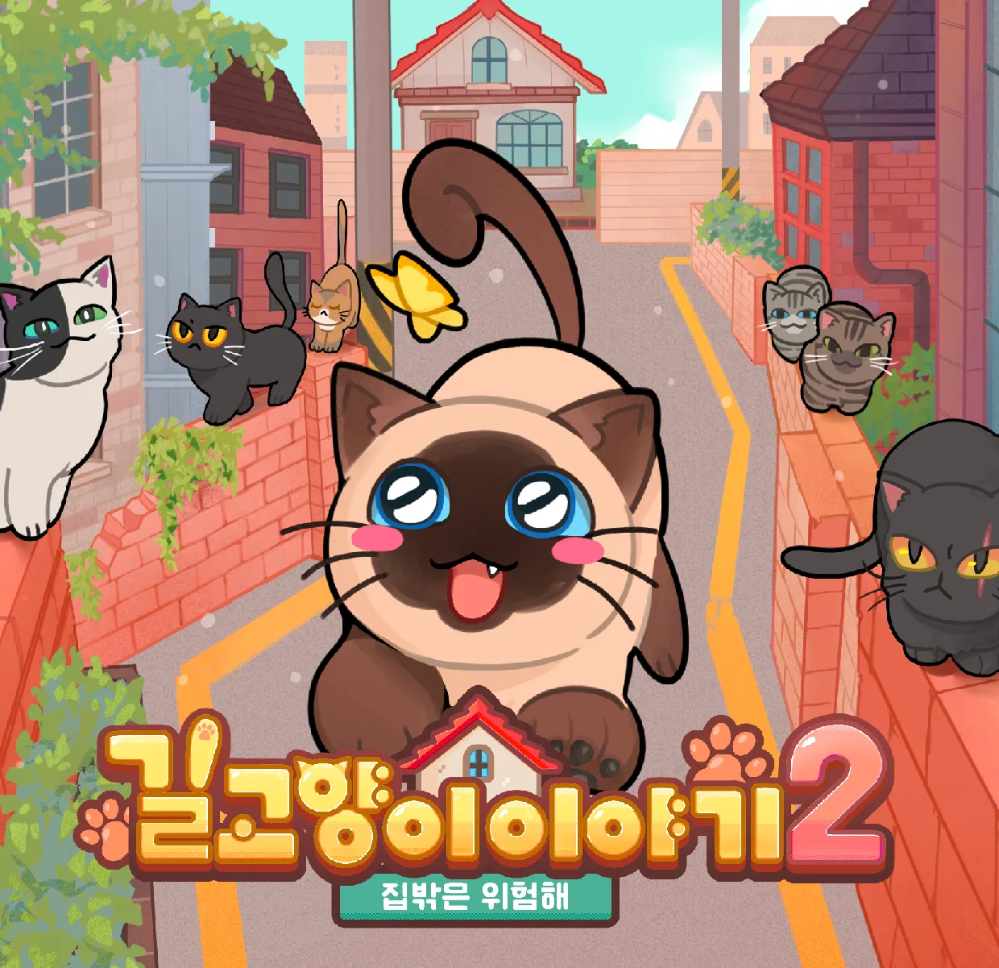
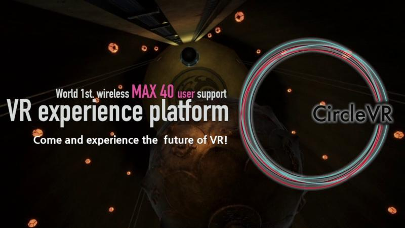

게임, 3D 제작 도구와 VR에서 참여한 대표 프로젝트를 선별해 회사별로 묶고, 회사와 프로젝트를 각각 최근 참여 종료 시점부터 정리했습니다. 제품 화면과 영상은 팀의 결과물이며, 각 사례에 제가 담당한 부분을 함께 적었습니다. 개인 오픈소스와 외부 기여는 뒤에 별도로 모았습니다.

전체 경력은 [이력서](/resume/), 문제 해결 과정은 [경력기술서](/cv/)에서 볼 수 있습니다. 이 문서에 포함하지 않은 작업은 [전체 프로젝트](/projects/)에서 확인할 수 있습니다.

## 시나몬

| 항목 | 내용 |
| --- | --- |
| 소속 기간 | 2024.06 - 2026.08 |
| 참여 형태 | 정규직 |
| 담당 직무 | 클라이언트 프로그래머 |

### Shotloom

| 항목 | 내용 |
| --- | --- |
| 참여 기간 | 2026.04 - 2026.08 |
| 주요 기술 | Rust, Bevy, WebGPU, React |

*스토리보드의 샷을 3D 장면으로 열어 카메라 구도를 조정한 팀의 제작 사례입니다.*

CINEVStudio 후속 개발의 속도를 높이기 위해 AI Native 개발 방식으로 전환한 브라우저 3D 편집기입니다. 팀이 선정한 기술 스택 위에서 캐릭터와 카메라 편집, 타임라인, 저장과 복원 및 생성 서비스 연동을 담당했습니다.

CineV에서 장면을 열어 편집하고 SceneGen으로 생성한 영상의 마지막 프레임 이미지를 다시 스토리보드로 보내는 흐름을 구현했습니다. 상세 글의 제작 영상과 저장 후 복원 화면에서 이 도구로 만드는 결과와 편집 과정을 볼 수 있습니다.

[제작 영상과 편집 과정](/projects/shotloom/) / [저장 구조와 담당 범위](/cv/#shotloom)

### CINEVStudio

| 항목 | 내용 |
| --- | --- |
| 참여 기간 | 2024.06 - 2026.04 |
| 주요 기술 | Unreal Engine 5, C++, Sequencer, UMG |

*캐릭터와 액션을 편집하는 팀의 제품 화면입니다.*

AI가 구성한 3D 장면을 사용자가 편집하고 영상으로 출력하는 제작 도구입니다. 콘텐츠팀의 액션 데이터 작성, AI 행동 해석과 생성 모션 연동을 개발했습니다. 샷 상태의 저장과 복원, 타임라인의 Root Motion 및 카메라 편집을 담당했습니다.

상세 글의 액션 입력 화면과 구조 도식은 제작 데이터가 실행으로 이어지는 과정을 보여줍니다. 제품 튜토리얼과 애니메이션 제작 영상에서 편집기의 사용 흐름을 확인할 수 있습니다.

[화면, 도식과 구현 예시](/projects/cinev-studio/) / [문제 해결 과정](/cv/#cinev-studio)

## 작두스튜디오

| 항목 | 내용 |
| --- | --- |
| 소속 기간 | 2021.01 - 2024.06 |
| 참여 형태 | 정규직 |
| 담당 직무 | 클라이언트 프로그래머 |

### Night of the Dead

| 항목 | 내용 |
| --- | --- |
| 참여 기간 | 2021.01 - 2024.06 |
| 주요 기술 | Unreal Engine 4/5, C++ |

*팀이 개발한 오픈월드 생존 게임의 공개 이미지입니다.*

전투, 장비와 좀비 AI를 구현하고 멀티플레이 동기화 및 런타임 최적화를 담당했습니다. 복제 대상과 전송 데이터를 관리하고 다수 좀비의 애니메이션 처리 비용을 줄였습니다. 얼리 액세스 업데이트부터 2024년 5월 1.0 정식 출시까지 참여했습니다.

프로젝트 글에는 업데이트별 게임 화면과 담당 기능을 정리했습니다. Replication Graph와 배열의 델타 복제를 적용한 과정은 경력기술서에서 설명합니다.

[업데이트별 담당 기능](/projects/night-of-the-dead/) / [동기화와 최적화](/cv/#night-of-the-dead) / [Steam 출시 페이지](https://store.steampowered.com/app/1377380/Night_of_the_Dead/)

## 삐요 스튜디오

| 항목 | 내용 |
| --- | --- |
| 소속 기간 | 2021.10 - 2023.12 |
| 참여 형태 | 비고용 팀 활동, 정규직과 병행 |
| 담당 직무 | 클라이언트 프로그래머 |

### 길고양이 이야기 2

| 항목 | 내용 |
| --- | --- |
| 참여 기간 | 2021.10 - 2023.12 |
| 주요 기술 | Unity, C# |

*팀이 개발한 2D 퍼즐 어드벤처의 대표 이미지입니다.*

세이브와 로드, 퀘스트, 대화, 이동, 컷신과 UI 등 주요 게임 시스템을 개발했습니다. 컨트롤러 입력과 상점 SDK를 연동하고 다국어 빌드 준비 및 검수에 참여했습니다.

2023년 STOVE Windows 얼리 액세스와 Steam Windows, macOS 정식 출시를 경험했습니다. 참여 프로젝트는 G-STAR 2023 Indie Awards의 Games for Impact를 수상했습니다. 본인 참여 범위는 2023년까지의 PC 개발 및 출시입니다.

[게임 영상과 출시, 수상 자료](/projects/a-street-cats-tale-2/) / [담당 범위](/cv/#a-street-cats-tale-2)

## 이메진 템페스트 스튜디오

| 항목 | 내용 |
| --- | --- |
| 소속 기간 | 2019.06 - 2020.04 |
| 참여 형태 | 비고용 팀 활동 |
| 담당 직무 | 기획 및 클라이언트 개발 |

### Vapor World

| 항목 | 내용 |
| --- | --- |
| 참여 기간 | 2019.06 - 2020.04 |
| 주요 기술 | Unity, C# |

2D 액션 어드벤처의 스토리와 세계관, 입력과 이동 및 전투 시스템을 개발했습니다. 참여 기간 중 출품한 프로젝트가 제11회 새로운 경기 게임오디션 공동 2위에 선정됐습니다.

[출품 영상과 개발 기록](/projects/vapor-world/)

## 클릭트

| 항목 | 내용 |
| --- | --- |
| 소속 기간 | 2016.07 - 2018.02 |
| 참여 형태 | 정규직 |
| 담당 직무 | VR 소프트웨어 엔지니어 |

Unity 기반 VR 클라이언트와 장치 간 연동을 개발했습니다. HTC Vive 트래커 정보를 소켓 통신으로 수신하는 기능을 담당했습니다. [담당 범위](/cv/#clicked)

### CircleVR

| 항목 | 내용 |
| --- | --- |
| 참여 기간 | 2017.06 - 2018.02 |
| 주요 기술 | Unity, C#, HTC Vive Tracker |

*다중 사용자 VR 체험과 외부 디스플레이를 연결한 전시 프로젝트입니다.*

HMD와 외부 트래커의 좌표계 및 장착 오프셋을 보정하고, 여러 사용자의 시점을 외부 디스플레이로 연결했습니다. 공개 시연 영상에서 다중 사용자 체험을 볼 수 있습니다.

[CircleVR 전시 영상](/projects/circle-vr/)

### Space Walker

| 항목 | 내용 |
| --- | --- |
| 참여 기간 | 2017.05 - 2017.06 |
| 주요 기술 | Unity, C#, Perception Neuron, GPU 파티클, onAirVR |

<iframe class="video-embed" src="https://www.youtube.com/embed/S7bRLNLz0TA?start=5" title="Space Walker - Unite ’17 Seoul 키노트 오프닝 공연" loading="lazy" allow="accelerometer; autoplay; clipboard-write; encrypted-media; gyroscope; picture-in-picture; web-share" referrerpolicy="strict-origin-when-cross-origin" allowfullscreen></iframe>

모션 트래킹 장비를 착용한 무용수의 춤을 VR 공간에서 실시간으로 볼 수 있는 콘텐츠입니다. Perception Neuron으로 전신 모션을 수집하고, 다수의 파티클 연산에는 GPU 파티클 시스템을 사용했습니다. VR 서버에서 렌더링한 콘텐츠는 onAirVR로 무선 전송했습니다.

저는 3D 배경 인터랙션을 구현하고, 다수의 파티클을 실시간으로 처리할 때의 성능 부담을 줄이기 위해 GPU 파티클 시스템을 적용했습니다. 전신 모션을 Unity Humanoid 아바타에 연결하고 좌표축 차이를 보정했습니다. 팀이 제작한 콘텐츠는 Unite ’17 Seoul의 키노트 오프닝 공연으로 시연됐습니다.

### onAirVR Client 2.0

| 항목 | 내용 |
| --- | --- |
| 참여 기간 | 2017.01 - 2017.05 |
| 주요 기술 | Unity, C#, OVR API, GoogleVR API |

클라이언트 UI 개선과 OVR API 대응, Daydream용 GoogleVR API 연동을 담당했습니다.

[onAirVR Client 2.0 시연](/projects/onairvr-client-2/)

## 육군 SW개발병

| 항목 | 내용 |
| --- | --- |
| 복무 기간 | 2018.03 - 2019.10 |
| 주요 기술 | C#, WPF, VBA |

- C#과 WPF를 활용한 기존 프로그램 이식 개발
- VBA를 활용한 엑셀 데이터 정리 프로그램 개발
- 육군 지휘통제시스템 장애 대응 및 운영
- SW 및 회의 지원으로 부대 운영에 기여해 우수상 수상
- 을지태극훈련 지원 공로로 표창 수상
- 응용체계관리반 분대장으로 임명되어 분대장 업무 수행

## 오픈소스와 개발 도구

### Grimoire

AI 에이전트의 코드 리뷰와 작업 인계, Git 운영을 재사용 가능한 Skill과 Plugin으로 만든 개인 오픈소스입니다. 요구사항과 설계 결정, 검증 및 PR을 연결하는 개발 흐름을 구성하고 유지보수합니다.

[소스와 사용법](https://github.com/hon454/grimoire)

### GitHub Pulls Show Reviewers

GitHub PR 목록에 리뷰 요청 대상과 리뷰 상태를 표시하는 Chrome 확장 프로그램입니다. 화면 갱신, API 캐시와 계정별 저장소 접근을 구현해 Chrome Web Store에 배포했습니다.

[동작 화면과 구현](/projects/github-pulls-show-reviewers/) / [소스 코드](https://github.com/hon454/github-pulls-show-reviewers) / [Chrome Web Store](https://chromewebstore.google.com/detail/github-pulls-show-reviewe/hoocgjopdboeghdkfjlkngkkpbiljggk)

### Copy Selection Context

선택한 코드의 파일 경로와 줄 번호를 함께 복사하는 JetBrains 플러그인입니다. 여러 위치에서 수집한 문맥을 보관하고 검토한 뒤 전달할 수 있도록 개발해 Marketplace에 배포했습니다.

[동작 화면과 기능](/projects/copy-selection-context/) / [소스 코드](https://github.com/hon454/copy-selection-context) / [JetBrains Marketplace](https://plugins.jetbrains.com/plugin/30262-copy-selection-context)

### 외부 프로젝트 기여

- **Firefly:** GitHub 카드의 빌드 캐시, Mermaid 렌더링, 레이아웃과 입력 처리를 개선하고 한국어 문서를 작성했습니다. [카드 캐시](https://github.com/CuteLeaf/Firefly/pull/588) / [스크롤 개선](https://github.com/CuteLeaf/Firefly/pull/613) / [한국어 문서](https://github.com/CuteLeaf/Firefly/pull/583)
- **bevy_vrm1:** Chrome WebGPU에서 VRM 표시 후 화면이 검게 변하는 문제를 재현하고 MToon 플래그 해석과 텍스처 샘플링 경로를 수정했습니다. [수정 PR](https://github.com/not-elm/bevy_vrm1/pull/57)

## 함께 일한 동료들의 추천

직책과 협업 관계는 함께 일한 당시를 기준으로 표기했습니다.

<blockquote class="career-recommendation">
  
기술적 문제의 근본 원인을 끝까지 파고드는 끈기.

  <footer class="recommendation-source">
    
<strong>홍XX</strong>시나몬 CTO, AI Lab Lead

    
상급자(비직속)번역 발췌

  </footer>
</blockquote>

<blockquote class="career-recommendation">
  
가장 신뢰했던 것은 복잡한 문제를 구조화하는 능력이었습니다.

  <footer class="recommendation-source">
    
<strong>황XX</strong>시나몬 Lead Software Engineer

    
직속 상사원문 발췌

  </footer>
</blockquote>

<blockquote class="career-recommendation">
  
미래지향적이면서도 신뢰할 수 있는 엔지니어.

  <footer class="recommendation-source">
    
<strong>고XX</strong>시나몬 AI PO

    
협업 동료(타 부서)번역 발췌

  </footer>
</blockquote>

[LinkedIn에서 추천사 전체 읽기](https://www.linkedin.com/in/jihoon-jeon-b7ab83116/details/recommendations/?detailScreenTabIndex=0)
