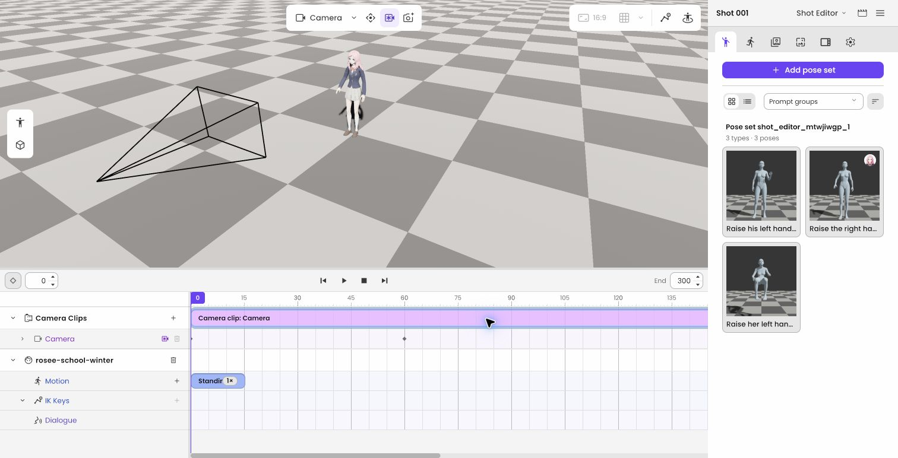

게임 클라이언트와 실시간 3D 제작 도구를 개발해 왔습니다. 대표 작업에서 맡은 문제와 구현 내용을 화면, 영상과 설계 자료로 소개합니다.

- **3D 제작 도구:** [Shotloom](#shotloom)의 편집과 저장 구조, [CINEVStudio](#cinevstudio)의 액션 데이터와 편집 UI 설계
- **게임 개발과 최적화:** [Night of the Dead](#night-of-the-dead)의 멀티플레이 동기화, 다수 좀비 처리와 게임플레이 구현
- **VR 장치 연동:** [CircleVR](#circlevr)의 좌표계 보정과 다중 사용자 전시, [Space Walker](#space-walker)의 실시간 모션 연동

[이력서](/resume/) / [경력기술서](/cv/) / [전체 프로젝트](/projects/)

## 시나몬

| 항목 | 내용 |
| --- | --- |
| 소속 기간 | 2024.06 - 2026.08 |
| 참여 형태 | 정규직 |
| 담당 직무 | 클라이언트 프로그래머 |

### Shotloom

| 항목 | 내용 |
| --- | --- |
| 소개 | 캐릭터 동작과 카메라를 편집하고 영상 생성 서비스와 연결하는 브라우저 3D 편집기 |
| 참여 기간 | 2026.04 - 2026.08 |
| 주요 기술 | Rust, Bevy, WebGPU, React |

- **편집과 저장의 일관성:** React UI, Rust 문서 모델과 Bevy 런타임을 연결하고 Undo/Redo와 저장, 복원을 구현했습니다. 드래그 시작부터 확정까지를 하나의 편집 트랜잭션으로 기록했습니다.
- **캐릭터와 카메라 저작:** 캐릭터 배치와 포즈 후보 적용, 카메라 키프레임을 편집 UI부터 타임라인 평가와 저장 형식까지 연결했습니다.
- **생성 서비스 통합:** CineV의 샷을 편집 가능한 3D 장면으로 열고, SceneGen 생성 영상의 마지막 프레임 이미지를 스토리보드로 반환하도록 구현했습니다. 생성과 결과 저장을 분리해 저장 실패 시 같은 결과를 다시 전송할 수 있게 했습니다.

*팀의 제작 사례에서 카메라 구도를 편집하는 화면입니다. 저는 팀이 선정한 기술 스택 위에서 캐릭터와 카메라 편집, 저장 및 서비스 연동을 담당했습니다.*

저장 후 다시 연 편집 상태

*로컬 실행에서 파일을 저장한 뒤 다시 연 화면입니다. 캐릭터와 포즈 후보, 클립, 0·60프레임의 카메라 키가 복원된 상태를 확인했습니다.*

[포즈와 카메라 편집 영상](/projects/shotloom/#editing-workflow) / [저장과 복원 구조](/projects/shotloom/#edit-persistence) / [서비스 통합과 검증 범위](/projects/shotloom/#service-integration)

### CINEVStudio

| 항목 | 내용 |
| --- | --- |
| 소개 | AI가 구성한 3D 장면을 편집하고 영상으로 출력하는 Unreal Engine 기반 제작 도구 |
| 참여 기간 | 2024.06 - 2026.04 |
| 주요 기술 | Unreal Engine 5, C++, Sequencer, UMG |

- **액션 데이터 작성 구조:** 문서와 대조하며 맞추던 액션 조건을 타입별 에셋 입력 구조로 바꿨습니다. 데이터 타입과 실행 경로, 변환기를 개발하고 정합성 검사와 전환 절차를 마련했습니다.
- **AI 결과의 실행과 편집:** AI의 행동 지시를 현재 장면에서 실행할 수 있는 액션으로 해석하고, 생성 모션을 선택해 타임라인에 적용하는 흐름을 구현했습니다. Undo/Redo와 저장, 복원까지 연결했습니다.
- **편집 UI와 공통 서비스:** UI Controller와 편집 State로 화면, 선택과 입력 처리를 나누고 Blackboard로 공유 상태를 전달했습니다. 공통 UI 컴포넌트를 개발하고 메시지 구독과 해제를 객체 수명에 맞췄습니다.
- **샷 상태와 재생:** 독립 Shot 모델이 초기 상태를 관리하도록 저장과 복원을 정리했습니다. Root Motion을 타임라인 조건에 맞춰 다시 계산하고 카메라 회전의 반경 손실과 뒤집힘을 해결했습니다.

*중앙 뷰포트와 하단 타임라인에서 캐릭터와 액션을 편집하는 팀의 제품 화면입니다. 저는 액션 데이터의 실행과 편집, UI 상태 관리 및 샷 복원 경로를 담당했습니다.*

액션 조건을 타입별로 작성하는 입력 화면

*콘텐츠 제작자가 대상별로 필요한 조건을 추가하는 프로토타입입니다. 데이터 타입과 변환 경로를 담당하고, 입력 도구 작업은 동료와 분담했습니다.*

[액션 입력과 실행 구조](/projects/cinev-studio/#data-authoring) / [UI 상태 관리와 도식](/projects/cinev-studio/#ui-state) / [제품 튜토리얼과 제작 영상](/projects/cinev-studio/#제품-화면과-실제-제작-사례)

## 작두스튜디오

| 항목 | 내용 |
| --- | --- |
| 소속 기간 | 2021.01 - 2024.06 |
| 참여 형태 | 정규직 |
| 담당 직무 | 클라이언트 프로그래머 |

### Night of the Dead

| 항목 | 내용 |
| --- | --- |
| 소개 | 좀비의 습격에 대비해 방어 시설을 만들고 생존하는 오픈월드 멀티플레이 게임 |
| 참여 기간 | 2021.01 - 2024.06 |
| 주요 기술 | Unreal Engine 4/5, C++ |

- **멀티플레이 동기화:** Replication Graph로 거리와 소유 관계에 따라 복제 대상을 나누고, Fast TArray Replication과 커스텀 NetSerialize로 배열 변경분과 전송 데이터를 처리했습니다.
- **다수 좀비의 실행 비용:** Animation Budget Allocator, Significance Manager와 AnimURO로 애니메이션 업데이트 비용을 줄이고 ACL로 애니메이션 데이터를 압축했습니다.
- **게임플레이와 출시:** 전투, 장비의 티어와 내구도, 파츠 개조, 보스 및 일반 좀비 AI를 구현했습니다. 얼리 액세스 업데이트부터 2024년 5월 1.0 정식 출시까지 참여했습니다.

*팀이 개발한 게임의 공개 이미지입니다. 제가 구현한 장비와 전투 기능은 업데이트별 담당 기록에, 동기화와 최적화의 적용 방식은 경력기술서에 정리했습니다.*

[장비와 전투 업데이트](/projects/night-of-the-dead/#equipment-update) / [동기화와 최적화](/cv/#night-of-the-dead) / [Steam 출시 페이지](https://store.steampowered.com/app/1377380/Night_of_the_Dead/)

## 삐요 스튜디오

| 항목 | 내용 |
| --- | --- |
| 소속 기간 | 2021.10 - 2023.12 |
| 참여 형태 | 비고용 팀 활동, 정규직과 병행 |
| 담당 직무 | 클라이언트 프로그래머 |

### 길고양이 이야기 2

| 항목 | 내용 |
| --- | --- |
| 소개 | 길고양이의 모험을 다룬 2D 퍼즐 어드벤처 |
| 참여 기간 | 2021.10 - 2023.12 |
| 주요 기술 | Unity, C# |

- **주요 게임 시스템:** 세이브와 로드, 퀘스트, 대화, 이동, 컷신과 UI를 개발했습니다.
- **PC 플랫폼 출시:** 컨트롤러 입력, Steam 업적과 STOVE 구매 인증을 연동하고 다국어 빌드 준비와 검수에 참여했습니다. 2023년 STOVE Windows 얼리 액세스와 Steam Windows, macOS 정식 출시까지 담당했습니다.

*팀의 게임 대표 이미지입니다. 프로젝트는 G-STAR 2023 Indie Awards의 Games for Impact를 수상했습니다. 제 참여 범위는 2023년까지의 PC 개발 및 출시입니다.*

[게임 영상과 출시, 수상 자료](/projects/a-street-cats-tale-2/) / [담당 범위](/cv/#a-street-cats-tale-2)

## 이메진 템페스트 스튜디오

| 항목 | 내용 |
| --- | --- |
| 소속 기간 | 2019.06 - 2020.04 |
| 참여 형태 | 비고용 팀 활동 |
| 담당 직무 | 기획 및 클라이언트 개발 |

### Vapor World

| 항목 | 내용 |
| --- | --- |
| 소개 | 환자들의 내면세계를 탐험하는 2D 액션 어드벤처 |
| 참여 기간 | 2019.06 - 2020.04 |
| 주요 기술 | Unity, C# |

- **기획과 클라이언트 개발:** 스토리와 세계관을 기획하고 입력, 이동과 전투 시스템을 개발했습니다.

참여 기간 중 출품한 프로젝트가 제11회 새로운 경기 게임오디션 공동 2위에 선정됐습니다.

[출품 영상과 개발 기록](/projects/vapor-world/)

## 클릭트

| 항목 | 내용 |
| --- | --- |
| 소속 기간 | 2016.07 - 2018.02 |
| 참여 형태 | 정규직 |
| 담당 직무 | VR 소프트웨어 엔지니어 |

Unity 기반 VR 클라이언트와 소켓 통신을 통한 장치 연동을 담당했습니다. [회사 내 담당 범위](/cv/#clicked)

### CircleVR

| 항목 | 내용 |
| --- | --- |
| 소개 | 여러 사용자의 VR 체험과 외부 디스플레이를 연결한 전시 시스템 |
| 참여 기간 | 2017.06 - 2018.02 |
| 주요 기술 | Unity, C#, HTC Vive Tracker |

- **장치 간 좌표 보정:** HMD와 외부 트래커의 좌표계를 맞추고 장착 오프셋을 보정했습니다.
- **체험과 외부 시점 연결:** 여러 사용자의 시점을 외부 디스플레이로 연결해 체험자의 화면을 관람객과 공유하도록 했습니다.

*팀이 제작한 전시 시스템입니다. 내부의 VR 체험과 외부에 표시되는 체험자 시점은 상세 글의 시연 영상에서 확인할 수 있습니다.*

[CircleVR 전시 영상](/projects/circle-vr/)

### Space Walker

| 항목 | 내용 |
| --- | --- |
| 소개 | 무용수의 움직임을 VR 공간에 실시간으로 연결하는 공연 콘텐츠 |
| 참여 기간 | 2017.05 - 2017.06 |
| 주요 기술 | Unity, C#, Perception Neuron, GPU 파티클, onAirVR |

- **전신 모션 연동:** Perception Neuron의 모션을 Unity Humanoid 아바타에 연결하고 좌표축 차이를 보정했습니다.
- **실시간 배경 연출:** 3D 배경 인터랙션을 구현하고, 다수의 파티클을 처리할 때의 성능 부담을 줄이기 위해 GPU 파티클 시스템을 적용했습니다.

<iframe class="video-embed" src="https://www.youtube.com/embed/S7bRLNLz0TA?start=5" title="Space Walker - Unite ’17 Seoul 키노트 오프닝 공연" loading="lazy" allow="accelerometer; autoplay; clipboard-write; encrypted-media; gyroscope; picture-in-picture; web-share" referrerpolicy="strict-origin-when-cross-origin" allowfullscreen></iframe>

*팀이 제작한 콘텐츠를 Unite ’17 Seoul 키노트 오프닝에서 시연한 영상입니다. 무용수의 움직임에 연결된 아바타와 배경 연출을 볼 수 있습니다.*

[공연 콘텐츠와 담당 업무](/projects/space-walker/)

### onAirVR Client 2.0

| 항목 | 내용 |
| --- | --- |
| 소개 | PC에서 렌더링한 VR 콘텐츠를 무선으로 전달받는 클라이언트 |
| 참여 기간 | 2017.01 - 2017.05 |
| 주요 기술 | Unity, C#, OVR API, GoogleVR API |

- **클라이언트 개선과 기기 대응:** UI를 개선하고 OVR API 변경에 대응했습니다. Daydream 지원을 위해 GoogleVR API를 연동했습니다.

[onAirVR Client 2.0 시연](/projects/onairvr-client-2/)

## 육군 SW개발병

| 항목 | 내용 |
| --- | --- |
| 복무 기간 | 2018.03 - 2019.10 |
| 주요 기술 | C#, WPF, VBA |

- C#과 WPF를 활용한 기존 프로그램 이식 개발
- VBA를 활용한 엑셀 데이터 정리 프로그램 개발
- 육군 지휘통제시스템 장애 대응 및 운영
- SW 및 회의 지원으로 부대 운영에 기여해 우수상 수상
- 을지태극훈련 지원 공로로 표창 수상
- 응용체계관리반 분대장으로 임명되어 분대장 업무 수행

## 오픈소스 프로젝트

### 유지관리자 (Maintainer)

#### [Grimoire](https://github.com/hon454/grimoire)

| 항목 | 내용 |
| --- | --- |
| 소개 | AI 에이전트의 코드 리뷰, 작업 인계와 Git 운영을 위한 재사용 가능한 Skill과 Plugin |
| 주요 기술 | Codex Skills, Plugin Hooks, Python, Git |

- **개발 흐름 구성:** 요구사항과 설계 결정, 검증 및 PR을 연결하는 작업 절차를 구성하고 유지보수합니다.
- **Skill과 Plugin 개발:** 코드 리뷰, 작업 인계와 Git 운영 절차를 Skill로 작성하고 설치 가능한 Plugin으로 제공합니다.

#### [GitHub Pulls Show Reviewers](https://github.com/hon454/github-pulls-show-reviewers)

| 항목 | 내용 |
| --- | --- |
| 소개 | GitHub PR 목록에 리뷰 요청 대상과 리뷰 상태를 표시하는 Chrome 확장 프로그램 |
| 주요 기술 | TypeScript, React, WXT, GitHub REST API |

- **리뷰 상태 표시:** 요청된 사용자와 팀, 리뷰어별 승인 및 변경 요청 상태를 PR 목록에 표시했습니다.
- **화면 갱신과 API 처리:** GitHub의 목록 갱신에 맞춰 표시를 복원하고, API 캐시와 동시 요청 수 제한을 구현했습니다.
- **계정 연동과 배포:** GitHub App으로 계정별 비공개 저장소 접근을 처리하고 [Chrome Web Store](https://chromewebstore.google.com/detail/github-pulls-show-reviewe/hoocgjopdboeghdkfjlkngkkpbiljggk)에 배포했습니다.

#### [Copy Selection Context](https://github.com/hon454/copy-selection-context)

| 항목 | 내용 |
| --- | --- |
| 소개 | 선택한 코드의 파일 경로와 줄 번호를 함께 복사하고 여러 파일의 문맥을 모으는 JetBrains 플러그인 |
| 주요 기술 | Kotlin, IntelliJ Platform |

- **코드와 위치 복사:** 선택 영역의 경로와 줄 범위를 계산하고, 여러 커서의 선택 영역과 사용자 지정 출력 형식을 지원했습니다.
- **문맥 수집과 검토:** 수집 당시의 코드와 위치를 스냅샷으로 보관하고, 도구 창에서 순서를 조정한 뒤 함께 복사하도록 구현했습니다.
- **검증과 배포:** 단위 테스트와 IntelliJ 플랫폼 테스트, 플러그인 호환성 검증을 구성하고 [JetBrains Marketplace](https://plugins.jetbrains.com/plugin/30262-copy-selection-context)에 배포했습니다.

### 기여자 (Contributor)

#### [Firefly](https://github.com/CuteLeaf/Firefly)

| 항목 | 내용 |
| --- | --- |
| 소개 | Astro와 Svelte 기반의 정적 블로그 테마 |
| 주요 기술 | Astro, Svelte, TypeScript, Mermaid |

- **[빌드와 렌더링 개선](https://github.com/CuteLeaf/Firefly/pull/588):** GitHub 카드의 빌드 캐시와 Mermaid 렌더링을 개선했습니다.
- **[화면과 입력 처리](https://github.com/CuteLeaf/Firefly/pull/613):** 레이아웃과 스크롤, 입력 처리를 개선했습니다.
- **[한국어 문서 작성](https://github.com/CuteLeaf/Firefly/pull/583):** 프로젝트의 한국어 문서를 작성했습니다.

#### [bevy_vrm1](https://github.com/not-elm/bevy_vrm1)

| 항목 | 내용 |
| --- | --- |
| 소개 | Bevy에서 VRM 1.0 아바타를 불러오고 렌더링하는 라이브러리 |
| 주요 기술 | Rust, Bevy, WebGPU |

- **[렌더링 오류 수정](https://github.com/not-elm/bevy_vrm1/pull/57):** Chrome WebGPU에서 VRM 표시 후 화면이 검게 변하는 문제를 재현하고, MToon 플래그 해석과 텍스처 샘플링 경로를 수정했습니다.

## 함께 일한 동료들의 추천

직책과 협업 관계는 함께 일한 당시를 기준으로 표기했습니다.

<blockquote class="career-recommendation">
  
기술적 문제의 근본 원인을 끝까지 파고드는 끈기.

  <footer class="recommendation-source">
    
<strong>홍XX</strong>시나몬 CTO, AI Lab Lead

    
상급자(비직속)번역 발췌

  </footer>
</blockquote>

<blockquote class="career-recommendation">
  
가장 신뢰했던 것은 복잡한 문제를 구조화하는 능력이었습니다.

  <footer class="recommendation-source">
    
<strong>황XX</strong>시나몬 Lead Software Engineer

    
직속 상사원문 발췌

  </footer>
</blockquote>

<blockquote class="career-recommendation">
  
미래지향적이면서도 신뢰할 수 있는 엔지니어.

  <footer class="recommendation-source">
    
<strong>고XX</strong>시나몬 AI PO

    
협업 동료(타 부서)번역 발췌

  </footer>
</blockquote>

[LinkedIn에서 추천사 전체 읽기](https://www.linkedin.com/in/jihoon-jeon-b7ab83116/details/recommendations/?detailScreenTabIndex=0)
